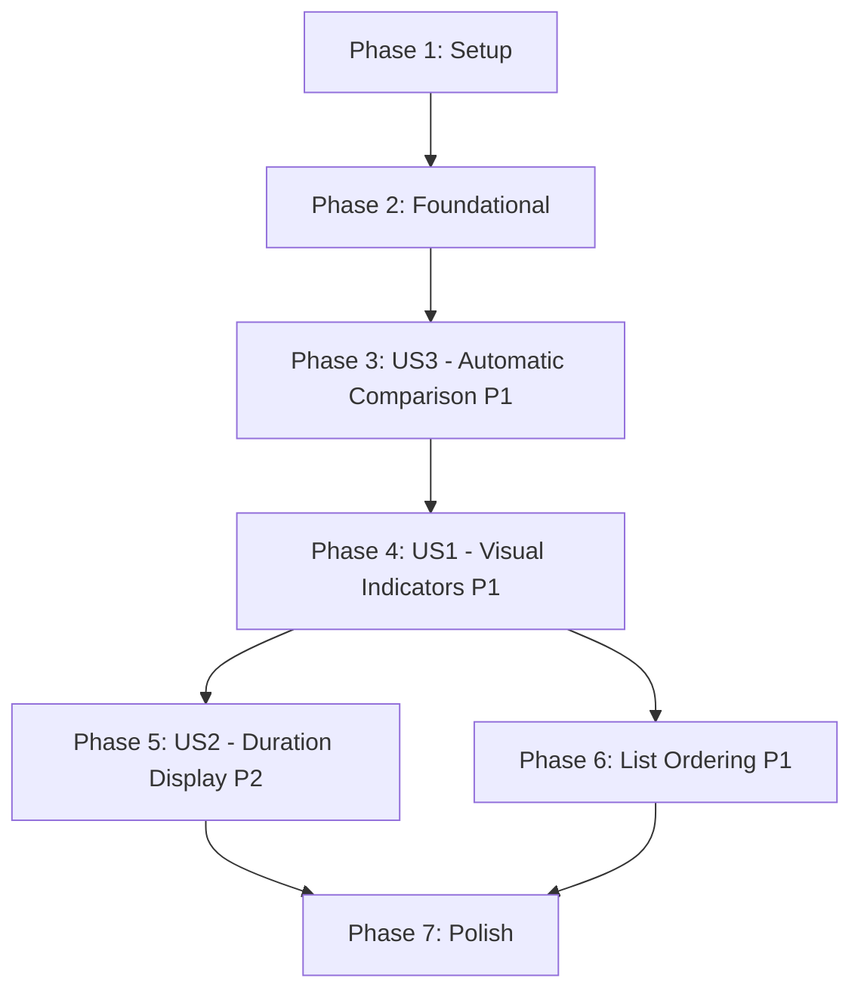

# Tasks: Overdue Todo Items

**Feature**: 001-overdue-todos  
**Branch**: `001-overdue-todos`  
**Input**: Design documents from `/specs/001-overdue-todos/`  
**Prerequisites**: plan.md, spec.md, research.md, data-model.md, quickstart.md

**Organization**: Tasks are grouped by user story to enable independent implementation and testing of each story.

## Format: `- [ ] [ID] [P?] [Story] Description`

- **[P]**: Can run in parallel (different files, no dependencies)
- **[Story]**: Which user story this task belongs to (e.g., US1, US2, US3)
- Include exact file paths in descriptions

## Path Conventions

- Web app structure: `packages/frontend/src/` and `packages/backend/src/`
- All changes in frontend only - no backend modifications needed

---

## Phase 1: Setup (Shared Infrastructure)

**Purpose**: Project initialization and verification

- [ ] T001 Verify project environment: Node.js 18+, npm 7+, dependencies installed
- [ ] T002 Verify danger color variables exist in packages/frontend/src/styles/theme.css (#c62828, #ef5350)
- [ ] T003 [P] Create utils directory structure: packages/frontend/src/utils/ and packages/frontend/src/utils/__tests__/

---

## Phase 2: Foundational (Blocking Prerequisites)

**Purpose**: Core date calculation utilities that ALL user stories depend on

**⚠️ CRITICAL**: No user story work can begin until this phase is complete

- [ ] T004 Create dateUtils.js in packages/frontend/src/utils/dateUtils.js with isOverdue() function
- [ ] T005 [P] Add getOverdueDays() function to packages/frontend/src/utils/dateUtils.js
- [ ] T006 [P] Add getDurationText() function to packages/frontend/src/utils/dateUtils.js for singular/plural grammar
- [ ] T007 [P] Add sortTodosByOverdue() function to packages/frontend/src/utils/dateUtils.js
- [ ] T008 Create unit tests in packages/frontend/src/utils/__tests__/dateUtils.test.js covering edge cases
- [ ] T009 Verify all dateUtils functions handle null/undefined dueDate gracefully
- [ ] T010 Verify date calculation performance <50ms for 100 todos

**Checkpoint**: Foundation ready - user story implementation can now begin in parallel

---

## Phase 3: User Story 3 - Automatic Date Comparison (Priority: P1) 🎯 Foundation

**Goal**: System automatically calculates overdue status for todos without user intervention

**Independent Test**: Create todos with various due dates and verify system calculates overdue status correctly on page load

### Implementation for User Story 3

- [ ] T011 [US3] Import isOverdue() utility in packages/frontend/src/components/TodoList.js
- [ ] T012 [US3] Add useEffect hook in packages/frontend/src/components/TodoList.js to handle page load recalculation
- [ ] T013 [US3] Add window focus event listener in packages/frontend/src/components/TodoList.js for FR-008
- [ ] T014 [US3] Add visibilitychange event listener in packages/frontend/src/components/TodoList.js for tab switching
- [ ] T015 [US3] Implement state refresh trigger when window regains focus in packages/frontend/src/components/TodoList.js
- [ ] T016 [US3] Add cleanup in useEffect return to remove event listeners in packages/frontend/src/components/TodoList.js
- [ ] T017 [US3] Verify todos with no dueDate never marked overdue in packages/frontend/src/components/TodoList.js

**Acceptance Verification**:
- [ ] System calculates overdue status on page load
- [ ] Overdue status updates when window regains focus
- [ ] Todos without due dates never show as overdue

**Checkpoint**: Automatic date comparison complete - visual indicators can now be added

---

## Phase 4: User Story 1 - Visual Identification of Overdue Todos (Priority: P1) 🎯 MVP

**Goal**: Users immediately identify overdue todos through red text, ⚠️ icon, and bold styling

**Independent Test**: Create todo with past due date and verify three visual indicators appear

### Implementation for User Story 1

- [ ] T018 [US1] Import isOverdue() utility in packages/frontend/src/components/TodoCard.js
- [ ] T019 [US1] Calculate overdue status in TodoCard component using todo.dueDate and todo.completed
- [ ] T020 [P] [US1] Add conditional CSS class 'overdue' to todo card div in packages/frontend/src/components/TodoCard.js
- [ ] T021 [P] [US1] Add warning icon ⚠️ before title when overdue in packages/frontend/src/components/TodoCard.js
- [ ] T022 [P] [US1] Add CSS rule for .overdue class with danger color in packages/frontend/src/components/TodoCard.css
- [ ] T023 [P] [US1] Add CSS rule for .overdue .todo-title with font-weight: 700 in packages/frontend/src/components/TodoCard.css
- [ ] T024 [P] [US1] Add CSS rule for .overdue-icon with margin-right: 8px in packages/frontend/src/components/TodoCard.css
- [ ] T025 [US1] Verify danger color applied to title and due date text when overdue
- [ ] T026 [US1] Verify warning icon renders at 16px size matching text
- [ ] T027 [US1] Verify bold font weight (700) applied to title when overdue
- [ ] T028 [US1] Verify completed todos never show overdue indicators regardless of due date
- [ ] T029 [US1] Verify indicators update immediately when todo.completed toggles (FR-009)
- [ ] T030 [US1] Verify indicators update immediately when todo.dueDate changes (FR-009)

**Acceptance Verification**:
- [ ] Todo with past due date shows red text, ⚠️ icon, and bold title
- [ ] Todo with today's date shows normal styling
- [ ] Todo with future date shows normal styling
- [ ] Completed overdue todo shows normal styling without indicators

**Checkpoint**: Visual identification complete - users can now see overdue todos

---

## Phase 5: User Story 2 - Overdue Duration Display (Priority: P2)

**Goal**: Users see duration text showing how many days a todo has been overdue

**Independent Test**: Create todos with various past due dates and verify correct duration text displays

### Implementation for User Story 2

- [ ] T031 [US2] Import getDurationText() utility in packages/frontend/src/components/TodoCard.js
- [ ] T032 [US2] Calculate duration text when todo is overdue in TodoCard component
- [ ] T033 [P] [US2] Add duration text element below todo title in packages/frontend/src/components/TodoCard.js
- [ ] T034 [P] [US2] Apply caption typography (12px, regular) to duration text in packages/frontend/src/components/TodoCard.css
- [ ] T035 [P] [US2] Apply danger color to duration text in packages/frontend/src/components/TodoCard.css
- [ ] T036 [US2] Verify "< 1 day overdue" displays for partial day (FR-006)
- [ ] T037 [US2] Verify "1 day overdue" (singular) displays for 24+ hours (FR-006)
- [ ] T038 [US2] Verify "7 days overdue" (plural) displays correctly (FR-006)
- [ ] T039 [US2] Verify no duration text displays for non-overdue todos
- [ ] T040 [US2] Verify duration updates when due date changes

**Acceptance Verification**:
- [ ] Todo overdue less than 24 hours shows "< 1 day overdue"
- [ ] Todo overdue 24+ hours shows "1 day overdue" (singular)
- [ ] Todo overdue 7 days shows "7 days overdue" (plural)
- [ ] Non-overdue todos show no duration text

**Checkpoint**: Duration display complete - users see context about overdue severity

---

## Phase 6: List Ordering (Priority: P1) 🎯 Critical UX

**Goal**: Overdue todos automatically appear at top of list for immediate visibility

**Independent Test**: Create mix of overdue and non-overdue todos, verify overdue appear first

### Implementation for List Ordering

- [ ] T041 [P] Import sortTodosByOverdue() utility in packages/frontend/src/components/TodoList.js
- [ ] T042 Apply sortTodosByOverdue() to todos array before rendering in packages/frontend/src/components/TodoList.js
- [ ] T043 Verify overdue todos appear at top of list (FR-010)
- [ ] T044 Verify overdue todos ordered by creation date newest first within group (FR-010)
- [ ] T045 Verify non-overdue todos appear after overdue, ordered by creation date newest first (FR-010)
- [ ] T046 Verify list re-sorts when todo becomes overdue (focus event triggers)
- [ ] T047 Verify list re-sorts when todo due date changes
- [ ] T048 Verify completed todos follow existing ordering rules (not affected by overdue)

**Acceptance Verification**:
- [ ] Multiple overdue todos appear at top of list
- [ ] Creation date order preserved within overdue group
- [ ] Non-overdue todos appear below overdue todos
- [ ] List updates automatically when overdue status changes

**Checkpoint**: List ordering complete - overdue todos prioritized for user attention

---

## Phase 7: Polish & Cross-Cutting Concerns

**Purpose**: Final refinements, accessibility, and edge case handling

- [ ] T049 [P] Verify WCAG AA color contrast for #c62828 on white background (light mode)
- [ ] T050 [P] Verify WCAG AA color contrast for #ef5350 on dark background (dark mode)
- [ ] T051 [P] Test with todos due dates far in past (years ago) - verify displays correctly
- [ ] T052 [P] Test with system time at exactly midnight when due date equals current date
- [ ] T053 [P] Test completing overdue todo - verify indicators disappear immediately
- [ ] T054 [P] Test unchecking completed overdue todo - verify indicators appear immediately
- [ ] T055 [P] Verify spacing and layout maintained with/without visual indicators
- [ ] T056 [P] Test performance with 100 todos (target <50ms calculation time)
- [ ] T057 [P] Verify warning icon ⚠️ renders correctly in all supported browsers
- [ ] T058 Run full test suite: `npm test --workspace=packages/frontend -- --coverage`
- [ ] T059 Verify test coverage ≥80% target met
- [ ] T060 Run linting: `npm run lint` (if configured) - verify no warnings
- [ ] T061 Manual browser testing: create, complete, edit overdue todos
- [ ] T062 Test window focus behavior: switch tabs and verify recalculation
- [ ] T063 Final code review: verify DRY, KISS, SOLID principles followed
- [ ] T064 Update feature documentation if any edge cases discovered

---

## Dependencies (User Story Completion Order)

**Critical Path**: Setup → Foundational → US3 → US1 → US2/Ordering → Polish

**Parallel Opportunities**: US2 and List Ordering can be implemented simultaneously after US1 completes

---

## Parallel Execution Examples

### After Foundational Phase Complete:
**Can work in parallel:**
- Developer A: Implement US3 automatic date comparison (T011-T017)
- Developer B: Write comprehensive tests for dateUtils (T008-T010)

### After US1 Complete:
**Can work in parallel:**
- Developer A: Implement US2 duration display (T031-T040)
- Developer B: Implement list ordering (T041-T048)
- Developer C: Start Polish accessibility checks (T049-T052)

### Polish Phase:
**Most tasks parallelizable** (T049-T064) - different testing areas, no dependencies

---

## Implementation Strategy

### MVP Scope (Recommended First Iteration)
- **Phase 1**: Setup (T001-T003)
- **Phase 2**: Foundational (T004-T010)
- **Phase 3**: US3 - Automatic Comparison (T011-T017)
- **Phase 4**: US1 - Visual Indicators (T018-T030)
- **Phase 6**: List Ordering (T041-T048)

**Result**: Core overdue detection and prioritization working end-to-end

### Enhancement Scope (Second Iteration)
- **Phase 5**: US2 - Duration Display (T031-T040)
- **Phase 7**: Polish (T049-T064)

**Result**: Full feature with duration text and polish

---

## Task Summary

- **Total Tasks**: 64
- **Setup**: 3 tasks
- **Foundational**: 7 tasks (blocking)
- **US3 (P1)**: 7 tasks - Automatic date comparison
- **US1 (P1)**: 13 tasks - Visual indicators (MVP critical)
- **US2 (P2)**: 10 tasks - Duration display (enhancement)
- **List Ordering (P1)**: 8 tasks - Automatic prioritization (MVP critical)
- **Polish**: 16 tasks - Final validation and edge cases

**Parallelizable Tasks**: 34 marked with [P]

**Independent Test Criteria**:
- US3: Page load calculates overdue status correctly
- US1: Visual indicators appear for past-due todos
- US2: Duration text shows correct day count with grammar
- Ordering: Overdue todos appear at top of list

**Suggested MVP**: Phases 1-4 + 6 (37 tasks) delivers core value
**Full Feature**: All phases (64 tasks) delivers complete specification
